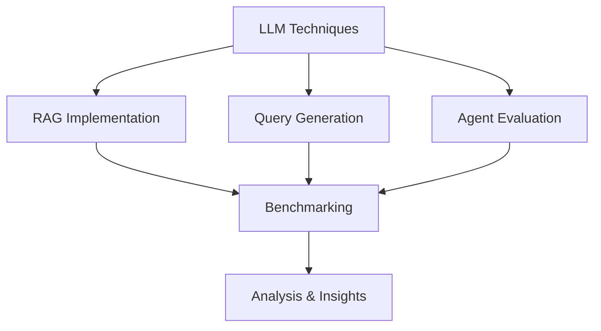

<div align="center">

# LLM Benchmarking Research

<br>

<h3>
<em>Exploring the Frontiers of Language Model Implementation</em>
</h3>

---

</div>

<br>

> "Understanding the nuances of LLM implementations through systematic evaluation and analysis"

<br>

<details>
<summary><h2>📊 Research Vision</h2></summary>



</details>

<br>

## Core Research Areas

<table>
<tr>
<td width="33%" align="center">
<h3>RAG Architectures</h3>
<br>
Systematic evaluation of retrieval strategies and their impact on response quality
</td>
<td width="33%" align="center">
<h3>Query Generation</h3>
<br>
Analysis of SQL generation capabilities across varying complexity levels
</td>
<td width="33%" align="center">
<h3>Agent Systems</h3>
<br>
Assessment of task completion and decision-making effectiveness
</td>
</tr>
</table>

<br>

## Implementation Framework

<div style="background-color: #f6f8fa; padding: 20px; border-radius: 6px;">

### Jupyter-Based Analysis Pipeline

```python
Research Pipeline
├── RAG Evaluation
│   ├── Implementation Comparison
│   ├── Performance Metrics
│   └── Quality Assessment
├── Query Generation
│   ├── Accuracy Analysis
│   └── Edge Case Handling
└── Agent Evaluation
    ├── Task Completion
    └── Resource Utilization
```

</div>

<br>

## Methodology

<table>
<tr>
<th colspan="2" align="center">Evaluation Framework</th>
</tr>
<tr>
<td width="50%">

### Quantitative Metrics
- Performance benchmarks
- Resource utilization
- Response timing
- Accuracy measurements

</td>
<td width="50%">

### Qualitative Analysis
- Response quality
- Context relevance
- Implementation complexity
- Scalability characteristics

</td>
</tr>
</table>

<br>

## Research Objectives

<div style="border-left: 4px solid #0366d6; padding-left: 20px;">

1. **Comprehensive Evaluation**
   - Systematic analysis of RAG implementations
   - Performance benchmarking across scenarios
   - Resource utilization patterns

2. **Implementation Insights**
   - Architecture effectiveness
   - Optimization opportunities
   - Best practice development

3. **Future Directions**
   - Emerging technique evaluation
   - Scalability assessment
   - Integration strategies

</div>

<br>

<details>
<summary><h2>Analysis Areas</h2></summary>

### RAG Implementation
- Architecture comparison
- Retrieval effectiveness
- Context handling
- Response quality

### Query Generation
- SQL accuracy
- Complex queries
- Edge cases
- Performance

### Agent Evaluation
- Task completion
- Decision making
- Resource usage
- Scalability

</details>

<br>

---

<div align="center">
<h4>Milvian Group Internal Research</h4>
<br>
<em>Advancing LLM Implementation Understanding</em>
</div>
