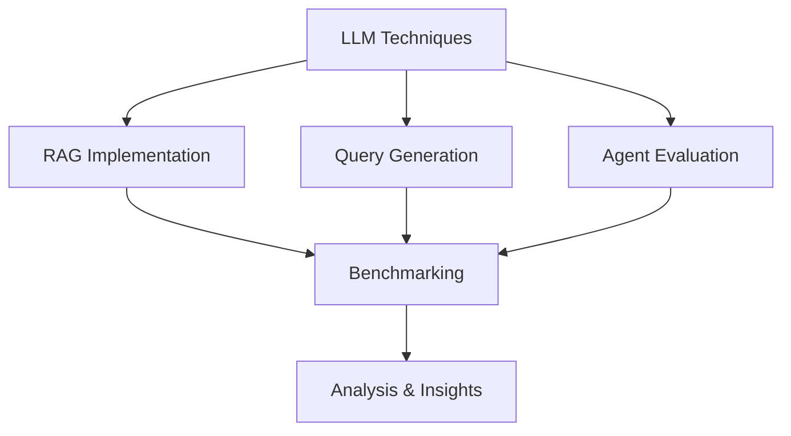

<div align="center">

# LLM Benchmarking Research

<br>

<h3>
<em>Exploring the Frontiers of Language Model Implementation</em>
</h3>

---

</div>

## Quick Start

### Prerequisites
- Python 3.8+
- Jupyter Lab/Notebook
- AWS Account with access to:
  - Amazon Bedrock
  - Amazon OpenSearch
  - Amazon Neptune
  - Amazon S3

### Getting Started

1. Clone the repository:
```bash
git clone [repository-url]
cd LLM_Benchmarking
```

2. Open and run the setup notebook:
```bash
jupyter lab setup.ipynb
```

The setup notebook will automatically:
- Install all required dependencies
- Configure AWS access based on your environment:
  - For SageMaker: Shows required IAM role permissions
  - For local: Provides AWS credential setup instructions
- Test all imports and utilities
- Create necessary directories

All dependencies will be installed in your current environment and will be available to all notebooks in the project.

### AWS Configuration

#### First Time Setup

1. Configure AWS Credentials:
   ```bash
   aws configure --profile Demo
   ```
   Enter your AWS credentials when prompted. You'll need:
   - AWS Access Key ID
   - AWS Secret Access Key
   - Default region (use us-west-2)
   - Default output format (json)

2. Create IAM Role:
   - Go to AWS IAM Console
   - Create new role named "SageMaker-RAG_Benchmark"
   - Add these policies:
     ```
     AmazonSageMakerFullAccess
     AmazonNeptuneFullAccess
     AmazonOpenSearchServiceFullAccess
     AmazonS3FullAccess
     AWSBedRockFullAccess
     ```

3. Run Neptune Setup:
   ```bash
   python development/scripts/test_neptune.py
   ```
   This script will:
   - Create VPC with public/private subnets
   - Set up NAT Gateway for internet access
   - Configure security groups for Neptune
   - Create Neptune cluster
   - Test connectivity
   
   The script is safe to run multiple times - it will reuse existing resources.

4. Create SageMaker Notebook:
   - After test_neptune.py succeeds, it will output VPC details
   - Use those values in this command:
   ```bash
   aws sagemaker create-notebook-instance \
     --notebook-instance-name Rag-Benchmark-Dev \
     --instance-type ml.m5.xlarge \
     --role-arn arn:aws:iam::[YOUR-ACCOUNT]:role/service-role/SageMaker-RAG_Benchmark \
     --subnet-id [PRIVATE-SUBNET-ID] \
     --security-group-ids [SECURITY-GROUP-ID] \
     --volume-size-in-gb 5 \
     --platform-identifier notebook-al2-v3 \
     --direct-internet-access Disabled \
     --profile Demo
   ```
   Replace:
   - [YOUR-ACCOUNT] with your AWS account ID
   - [PRIVATE-SUBNET-ID] with subnet ID from test_neptune.py
   - [SECURITY-GROUP-ID] with security group ID from test_neptune.py

5. Wait for notebook to be ready (~5-10 minutes):
   ```bash
   aws sagemaker describe-notebook-instance \
     --notebook-instance-name Rag-Benchmark-Dev \
     --profile Demo
   ```
   Wait for "Status": "InService"

6. Open the notebook:
   - Go to SageMaker Console
   - Click "Notebook instances"
   - Find "Rag-Benchmark-Dev"
   - Click "Open JupyterLab"

7. Test Neptune Connection:
   - Open test_neptune_connection.ipynb
   - Run all cells
   - If connection fails, see Troubleshooting section

#### Current Infrastructure
If infrastructure is already set up, these are the details:

1. VPC Configuration:
   - VPC ID: vpc-022d0e2853ed602bf
   - Private Subnets: subnet-077c6d536982ad16a, subnet-02c6470f4f7828a63
   - Security Group: sg-0f8f329adc7215501 (allows Neptune access)
   - NAT Gateway configured for outbound internet access

2. SageMaker Notebook:
   - URL: rag-benchmark-dev-q5en.notebook.us-west-2.sagemaker.aws
   - Instance Type: ml.m5.xlarge
   - VPC: Configured in private subnet with NAT Gateway
   - IAM Role: SageMaker-RAG_Benchmark

Required IAM Role Permissions:
- bedrock:InvokeModel
- opensearch:*
- neptune-db:*
- s3:*

#### Troubleshooting

1. If notebook can't access Neptune:
   ```bash
   # Stop notebook instance
   aws sagemaker stop-notebook-instance \
     --notebook-instance-name Rag-Benchmark-Dev \
     --profile Demo

   # Wait for it to stop
   aws sagemaker describe-notebook-instance \
     --notebook-instance-name Rag-Benchmark-Dev \
     --profile Demo

   # Update notebook VPC config
   aws sagemaker update-notebook-instance \
     --notebook-instance-name Rag-Benchmark-Dev \
     --subnet-id [PRIVATE-SUBNET-ID] \
     --security-group-ids [SECURITY-GROUP-ID] \
     --profile Demo

   # Start notebook instance
   aws sagemaker start-notebook-instance \
     --notebook-instance-name Rag-Benchmark-Dev \
     --profile Demo
   ```

2. If Neptune connection fails:
   - Check security group allows port 8182
   - Verify notebook is in correct subnet
   - Ensure NAT Gateway is working
   - Test connectivity using test_neptune.py

#### Local Users
If running locally, you can configure AWS access through:
1. AWS CLI (Recommended): `aws configure`
2. Environment variables
3. AWS credentials file

The setup notebook will guide you through the process.

## Usage

### Comparing RAG Implementations

1. Open the comparison notebook:
```bash
jupyter lab evaluation_pipelines/templates/rag_comparison.ipynb
```

2. Update the configuration section with:
- Your RAG implementations
- Dataset paths
- Evaluation metrics

3. Run the notebook cells to:
- Load implementations
- Run evaluations
- Generate visualizations
- Analyze results

### Tuning RAG Parameters

1. Open the tuning notebook:
```bash
jupyter lab evaluation_pipelines/templates/rag_tuning.ipynb
```

2. Configure:
- Implementation to tune
- Parameter grid
- Evaluation datasets
- Metric weights

3. Run the notebook to:
- Test parameter combinations
- Find optimal settings
- Validate results

## Project Structure

```
LLM_Benchmarking/
├── datasets/                          # Evaluation datasets
│   ├── rag_evaluation/
│   │   ├── labeled/                  # Labeled datasets
│   │   └── unlabeled/               # Unlabeled datasets
│   └── sql_evaluation/              # Future SQL datasets
│
├── rag_implementations/              # RAG implementations
│   ├── baseline_rag/
│   │   ├── implementation.ipynb
│   │   └── ingestion.ipynb
│   └── graph_rag/
│       ├── implementation.ipynb
│       └── ingestion.ipynb
│
├── evaluation_pipelines/             # Evaluation notebooks
│   ├── templates/                    # Reusable templates
│   └── rag_evaluations/             # Specific evaluations
│
└── utils/                           # Shared utilities
    ├── metrics/                     # Evaluation metrics
    ├── visualization/               # Plotting utilities
    └── notebook_utils/              # Notebook helpers
```

---

<br>

> "Understanding the nuances of LLM implementations through systematic evaluation and analysis"

<br>

<details>
<summary><h2>📊 Research Vision</h2></summary>



</details>

<br>

## Core Research Areas

<table>
<tr>
<td width="33%" align="center">
<h3>RAG Architectures</h3>
<br>
Systematic evaluation of retrieval strategies and their impact on response quality
</td>
<td width="33%" align="center">
<h3>Query Generation</h3>
<br>
Analysis of SQL generation capabilities across varying complexity levels
</td>
<td width="33%" align="center">
<h3>Agent Systems</h3>
<br>
Assessment of task completion and decision-making effectiveness
</td>
</tr>
</table>

<br>

## Implementation Framework

<div style="background-color: #f6f8fa; padding: 20px; border-radius: 6px;">

### Jupyter-Based Analysis Pipeline

```python
Research Pipeline
├── RAG Evaluation
│   ├── Implementation Comparison
│   ├── Performance Metrics
│   └── Quality Assessment
├── Query Generation
│   ├── Accuracy Analysis
│   └── Edge Case Handling
└── Agent Evaluation
    ├── Task Completion
    └── Resource Utilization
```

</div>

<br>

## Methodology

<table>
<tr>
<th colspan="2" align="center">Evaluation Framework</th>
</tr>
<tr>
<td width="50%">

### Quantitative Metrics
- Performance benchmarks
- Resource utilization
- Response timing
- Accuracy measurements

</td>
<td width="50%">

### Qualitative Analysis
- Response quality
- Context relevance
- Implementation complexity
- Scalability characteristics

</td>
</tr>
</table>

<br>

## Research Objectives

<div style="border-left: 4px solid #0366d6; padding-left: 20px;">

1. **Comprehensive Evaluation**
   - Systematic analysis of RAG implementations
   - Performance benchmarking across scenarios
   - Resource utilization patterns

2. **Implementation Insights**
   - Architecture effectiveness
   - Optimization opportunities
   - Best practice development

3. **Future Directions**
   - Emerging technique evaluation
   - Scalability assessment
   - Integration strategies

</div>

<br>

<details>
<summary><h2>Analysis Areas</h2></summary>

### RAG Implementation
- Architecture comparison
- Retrieval effectiveness
- Context handling
- Response quality

### Query Generation
- SQL accuracy
- Complex queries
- Edge cases
- Performance

### Agent Evaluation
- Task completion
- Decision making
- Resource usage
- Scalability

</details>

<br>

---

<div align="center">
<h4>Milvian Group Internal Research</h4>
<br>
<em>Advancing LLM Implementation Understanding</em>
</div>

