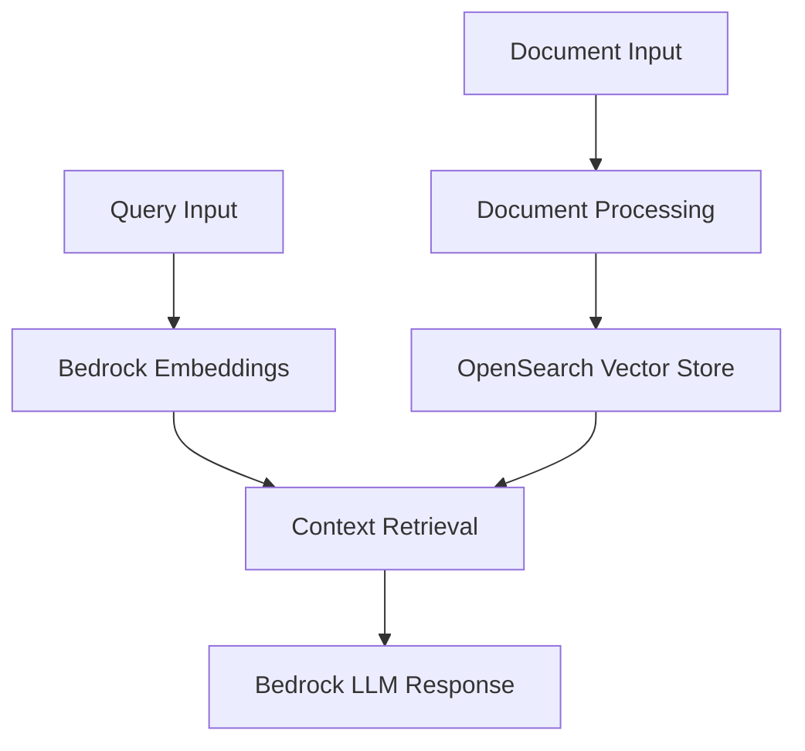
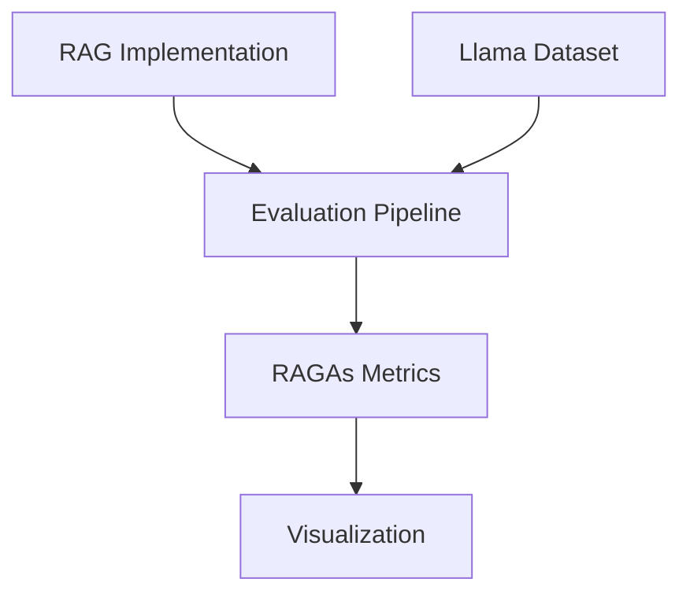
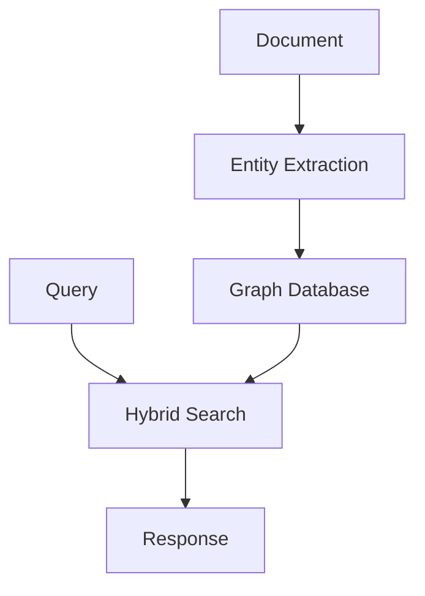

# System Patterns

## Core Architectural Patterns

### 1. RAG Implementation Pattern


#### Implementation Structure
- Located in `rag_implementations/baseline_rag/`
- Split into ingestion and implementation notebooks
- Uses AWS services for core functionality

#### Key Components
1. **Document Processing**
   - Text cleaning and normalization
   - Configurable chunking
   - Metadata preservation
   - Batch ingestion support

2. **Vector Storage (OpenSearch)**
   - KNN vector search
   - Cosine similarity scoring
   - Batch document ingestion
   - Metadata storage

3. **LLM Integration (Bedrock)**
   - Claude 3.5 Sonnet for responses
   - Cohere Embed English for embeddings
   - Async request handling
   - Rate limiting support

### 2. Evaluation Framework Pattern


#### Implementation Structure
- Located in `evaluation_pipelines/`
- Templates for comparison and tuning
- Standardized evaluation process

#### Components
1. **Dataset Management**
   - Automatic downloading
   - Local caching
   - Source file management
   - Batch processing

2. **Metrics System (RAGAs)**
   - Faithfulness scoring
   - Context precision/recall
   - Response relevancy
   - Entity recall
   - Noise sensitivity

3. **Visualization**
   - Bar plots with error bars
   - Radar plots for comparison
   - Heatmaps for correlations
   - Time series support

## Implementation Guidelines

### 1. Code Organization
```
LLM_Benchmarking/
├── datasets/                           # Dataset management
│   └── rag_evaluation/
│       ├── labeled/                    # Labeled datasets
│       └── unlabeled/                  # Unlabeled datasets
├── rag_implementations/                # RAG implementations
│   └── baseline_rag/
│       ├── implementation.ipynb        # Core implementation
│       └── ingestion.ipynb            # Document ingestion
├── evaluation_pipelines/               # Evaluation framework
│   ├── templates/                      # Reusable templates
│   └── rag_evaluations/               # Specific evaluations
└── utils/                             # Shared utilities
    ├── metrics/                        # Evaluation metrics
    ├── notebook_utils/                 # Notebook helpers
    └── visualization/                  # Plot generation
```

### 2. AWS Integration Pattern
- Use Bedrock for LLM and embeddings
- Use OpenSearch for vector storage
- Implement proper error handling
- Support async operations

### 3. Dataset Handling Pattern
- Support Llama datasets
- Implement local caching
- Handle batch processing
- Preserve metadata

## Best Practices

### 1. Document Processing
- Use configurable chunking
- Preserve document metadata
- Support batch operations
- Implement caching where appropriate

### 2. Evaluation
- Use standardized metrics (RAGAs)
- Support both labeled/unlabeled data
- Implement rate limiting
- Generate visual reports

### 3. Code Quality
- Use Jupyter notebooks for interactive development
- Implement utility functions for reusability
- Document key functions and classes
- Handle errors gracefully

## Performance Patterns

### 1. Batch Processing
- Implement in document ingestion
- Use in evaluation pipelines
- Support async operations
- Handle rate limits

### 2. Caching
- Cache embeddings where possible
- Store downloaded datasets locally
- Implement result caching
- Use efficient data structures

## Testing Patterns

### 1. Dataset Testing
- Test with Covid-19 dataset
- Support multiple dataset types
- Validate processing results
- Check metadata preservation

### 2. Performance Testing
- Monitor response times
- Track resource usage
- Validate batch processing
- Test rate limiting

## Future Patterns (Planned)

### 1. GraphRAG Pattern


### 2. Parameter Tuning Pattern
- Support multiple parameters
- Track performance impact
- Generate optimization suggestions
- Visualize results
