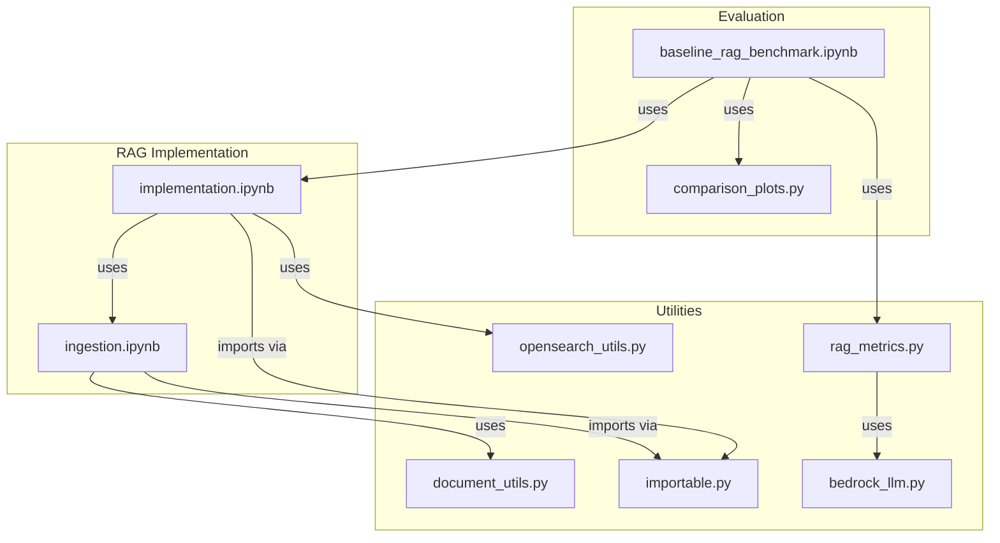
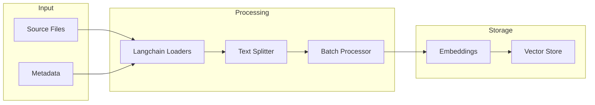
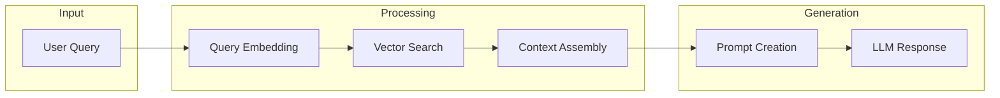

# Codebase Structure

## Core Components

### RAG Implementation

## File Dependencies

### 1. rag_implementations/baseline_rag/implementation.ipynb
- Primary: Core RAG functionality
- Dependencies:
  - ingestion.ipynb: Document processing
  - opensearch_utils.py: Vector store management
  - importable.py: Notebook imports
- Used by:
  - baseline_rag_benchmark.ipynb: For evaluation
- Key interfaces:
  - ingest_documents(): Delegates to ingestion.ipynb
  - query(): Main RAG pipeline
  - _store_documents(): Vector storage

### 2. rag_implementations/baseline_rag/ingestion.ipynb
- Primary: Document processing
- Dependencies:
  - document_utils.py: Text processing
  - langchain: Document loaders
  - importable.py: Notebook imports
- Used by:
  - implementation.ipynb: For document ingestion
- Key interfaces:
  - process_documents(): File processing
  - process_directory(): Batch processing
  - ingest_documents(): Main entry point

### 3. utils/metrics/bedrock_llm.py (~80 lines)
- Primary: AWS Bedrock LLM wrapper
- Dependencies:
  - boto3: AWS SDK
  - langchain_core: Base LLM interface
- Used by:
  - rag_metrics.py: For RAG evaluation
- Key interfaces:
  - BedrockLLM: Main wrapper class
  - _call(): Execute LLM requests
  - _generate(): Handle multiple prompts

### 4. utils/metrics/rag_metrics.py (~180 lines)
- Primary: RAG evaluation metrics
- Dependencies:
  - ragas: Evaluation framework
  - bedrock_llm.py: LLM wrapper
  - comparison_plots.py: Visualization
- Used by:
  - benchmark notebooks: For evaluation
- Key interfaces:
  - RAGMetricsEvaluator: Main evaluator class
  - evaluate_labeled(): Full evaluation
  - evaluate_unlabeled(): Partial evaluation

### 5. utils/aws/opensearch_utils.py (~160 lines)
- Primary: OpenSearch management
- Dependencies:
  - boto3: AWS SDK
  - opensearchpy: Vector operations
- Used by:
  - implementation.ipynb: For vector storage
  - benchmark notebooks: For setup/cleanup
- Key interfaces:
  - OpenSearchManager: Domain lifecycle

### 6. utils/notebook_utils/document_utils.py (~150 lines)
- Primary: Text processing utilities
- Dependencies:
  - None (standard library only)
- Used by:
  - ingestion.ipynb: For text processing
  - benchmark notebooks: For dataset loading
- Key interfaces:
  - DocumentPreprocessor: Text chunking
  - ingest_documents(): Utility wrapper

### 7. utils/notebook_utils/dataset_utils.py (~120 lines)
- Primary: Dataset management
- Dependencies:
  - llama_index: Dataset loading
  - document_utils.py: Processing
- Used by:
  - benchmark notebooks: For data loading
- Key interfaces:
  - download_dataset(): Get datasets
  - load_labeled_dataset(): Load with answers
  - prepare_documents_for_rag(): Format for ingestion

### 8. utils/notebook_utils/importable.py (~100 lines)
- Primary: Notebook import utility
- Dependencies:
  - nbformat: Notebook parsing
- Used by:
  - All notebooks for imports
- Key interfaces:
  - notebook_to_module(): Main converter
  - NotebookLoader: Context manager

### 9. utils/visualization/comparison_plots.py (~180 lines)
- Primary: Visualization utilities
- Dependencies:
  - matplotlib: Base plotting
  - seaborn: Enhanced visuals
- Used by:
  - benchmark notebooks: For results
  - rag_metrics.py: For evaluation plots
- Key interfaces:
  - BenchmarkVisualizer: Main visualization class
  - plot_comparison(): Generic plotting
  - create_comparison_report(): Full reports

## Code Patterns

### Document Processing Flow

### Query Flow

## File Size Management
All files are confirmed to be under 200 lines:
- implementation.ipynb: ~180 lines
- ingestion.ipynb: ~180 lines
- bedrock_llm.py: ~80 lines
- rag_metrics.py: ~180 lines
- opensearch_utils.py: ~160 lines
- document_utils.py: ~150 lines
- dataset_utils.py: ~120 lines
- importable.py: ~100 lines
- comparison_plots.py: ~180 lines

## Testing Coverage
- Unit tests needed for:
  - document_utils.py
  - opensearch_utils.py
  - importable.py
  - bedrock_llm.py
  - rag_metrics.py
- Integration tests needed for:
  - Document processing pipeline
  - Vector storage operations
  - End-to-end RAG workflow
  - Evaluation pipeline

## Future Improvements
1. Document Processing:
   - Add more file type support
   - Improve chunking strategies
   - Enhance metadata handling
   - Add caching layer

2. Vector Operations:
   - Add caching layer
   - Optimize batch sizes
   - Improve error recovery
   - Add async operations

3. Testing:
   - Add automated tests
   - Create test datasets
   - Measure performance metrics
   - Add integration tests

4. Evaluation:
   - Add custom metrics
   - Enhance visualization
   - Add batch evaluation
   - Improve error analysis
