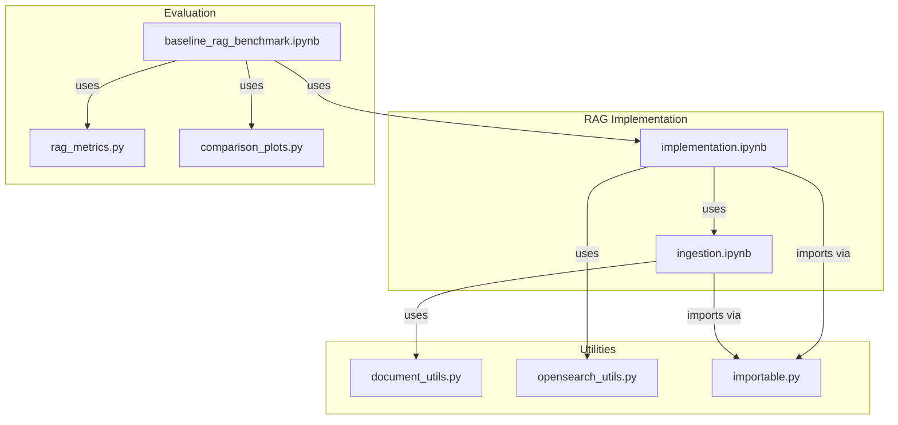
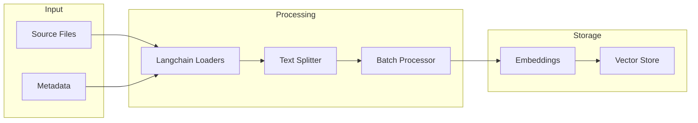
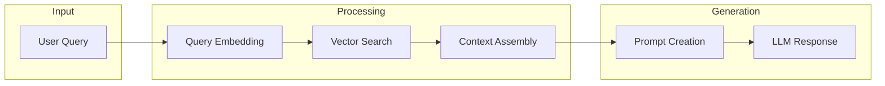

# Codebase Structure

## Core Components

### RAG Implementation

## File Dependencies

### 1. rag_implementations/baseline_rag/implementation.ipynb
- Primary: Core RAG functionality
- Dependencies:
  - ingestion.ipynb: Document processing
  - opensearch_utils.py: Vector store management
  - importable.py: Notebook imports
- Used by:
  - baseline_rag_benchmark.ipynb: For evaluation
- Key interfaces:
  - ingest_documents(): Delegates to ingestion.ipynb
  - query(): Main RAG pipeline
  - _store_documents(): Vector storage

### 2. rag_implementations/baseline_rag/ingestion.ipynb
- Primary: Document processing
- Dependencies:
  - document_utils.py: Text processing
  - langchain: Document loaders
  - importable.py: Notebook imports
- Used by:
  - implementation.ipynb: For document ingestion
- Key interfaces:
  - process_documents(): File processing
  - process_directory(): Batch processing
  - ingest_documents(): Main entry point

### 3. utils/notebook_utils/document_utils.py
- Primary: Text processing utilities
- Dependencies:
  - None (standard library only)
- Used by:
  - ingestion.ipynb: For text processing
  - benchmark notebooks: For dataset loading
- Key interfaces:
  - DocumentPreprocessor: Text chunking
  - ingest_documents(): Utility wrapper

### 4. utils/aws/opensearch_utils.py
- Primary: OpenSearch management
- Dependencies:
  - boto3: AWS SDK
  - opensearchpy: Vector operations
- Used by:
  - implementation.ipynb: For vector storage
  - benchmark notebooks: For setup/cleanup
- Key interfaces:
  - OpenSearchManager: Domain lifecycle

### 5. utils/notebook_utils/importable.py
- Primary: Notebook import utility
- Dependencies:
  - nbformat: Notebook parsing
- Used by:
  - All notebooks for imports
- Key interfaces:
  - notebook_to_module(): Main converter

### 6. evaluation_pipelines/rag_evaluations/baseline_rag_benchmark.ipynb
- Primary: RAG evaluation
- Dependencies:
  - implementation.ipynb: RAG system
  - rag_metrics.py: Evaluation metrics
  - comparison_plots.py: Visualization
  - opensearch_utils.py: Resource management
- Used by:
  - Results analysis and reporting
- Key interfaces:
  - run_evaluation(): Main benchmark
  - test_queries(): Example usage

## Code Patterns

### Document Processing Flow

### Query Flow

## File Size Management
- All files must stay under 200 lines
- Current line counts:
  - implementation.ipynb: ~180 lines
  - ingestion.ipynb: ~180 lines
  - document_utils.py: ~150 lines
  - opensearch_utils.py: ~160 lines

## Testing Coverage
- Unit tests needed for:
  - document_utils.py
  - opensearch_utils.py
  - importable.py
- Integration tests needed for:
  - Document processing pipeline
  - Vector storage operations
  - End-to-end RAG workflow

## Future Improvements
1. Document Processing:
   - Add more file type support
   - Improve chunking strategies
   - Enhance metadata handling

2. Vector Operations:
   - Add caching layer
   - Optimize batch sizes
   - Improve error recovery

3. Testing:
   - Add automated tests
   - Create test datasets
   - Measure performance metrics
