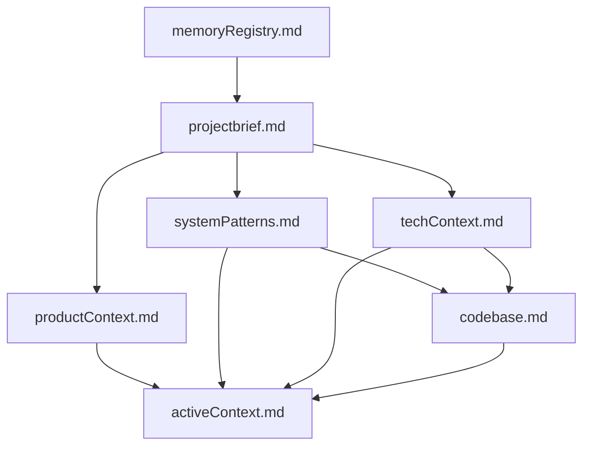

# Memory Registry

## Core Memory Banks

| File | Purpose | Last Updated |
|------|---------|--------------|
| projectbrief.md | Project goals, milestones, and high-level requirements | 2024-02-13 |
| activeContext.md | Current work focus, implementation status, and recent decisions | 2024-02-13 |
| techContext.md | Technology stack, infrastructure, and development environment | 2024-02-13 |
| systemPatterns.md | Architecture patterns, code organization, and key components | 2024-02-13 |
| codebase.md | File relationships, dependencies, and implementation details | 2024-02-13 |

## Project Rules and Conventions

| File | Purpose | Last Updated |
|------|---------|--------------|
| .clinerules | Project-specific conventions, patterns, and learned practices | 2024-02-13 |

## File Dependencies

## Notes
- All dates reflect initial creation or last substantial update
- Memory banks are organized by primary function
- Content is migrated from previous Cline Docs system
- Each file maintains focused, specific purpose

## File Relationships
- projectbrief.md defines overall goals
- systemPatterns.md informs codebase.md structure
- techContext.md provides implementation context
- codebase.md tracks detailed implementation
- activeContext.md reflects current state
- .clinerules enforces conventions
