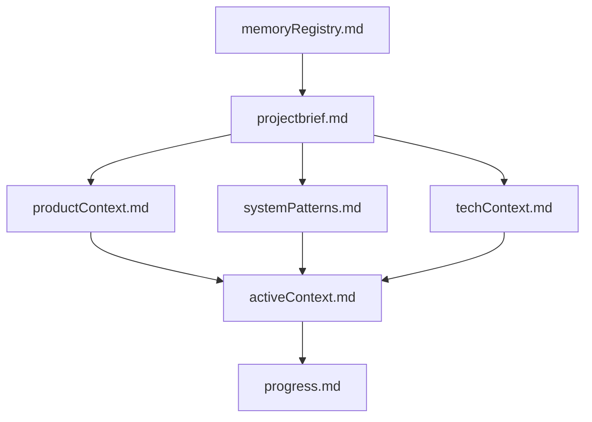

# Memory Registry

## Core Files

### activeContext.md
- Last Updated: 2024-02-13 21:56
- Changes:
  - Added RAG evaluation pipeline section
  - Updated OpenSearch query testing status
  - Added progress tracking details
  - Updated next steps

### progress.md
- Last Updated: 2024-02-13 21:57
- Changes:
  - Added RAG evaluation pipeline status
  - Updated in-progress features
  - Added progress visualization details
  - Updated timeline

### projectbrief.md
- Last Updated: Initial setup
- Core project requirements and goals
- Foundation for all development work

### productContext.md
- Last Updated: Initial setup
- Problem space and solution approach
- User experience goals

### systemPatterns.md
- Last Updated: Initial setup
- System architecture decisions
- Component relationships
- Design patterns

### techContext.md
- Last Updated: Initial setup
- Technology stack details
- Development environment
- Dependencies

### codebase.md
- Last Updated: Initial setup
- Code organization
- File structure
- Implementation patterns

## Dependencies

## Recent Updates

### RAG Evaluation Pipeline
- Fixed RAGAs integration
- Added progress tracking
- Updated benchmark notebook
- Added error handling

### OpenSearch Query Testing
- Created test notebook
- Added query variations
- Implemented error analysis
- Added progress tracking

### Document Processing
- Langchain integration
- Chunking configuration
- Metadata handling
- Batch processing

## Task-Relevant Files

### Current Task: RAG Evaluation Debug
1. Primary:
   - evaluation_pipelines/rag_evaluations/baseline_rag_benchmark.ipynb
   - utils/metrics/rag_metrics.py
   - development/notebooks/test_opensearch_query.ipynb

2. Supporting:
   - rag_implementations/baseline_rag/implementation.ipynb
   - rag_implementations/baseline_rag/ingestion.ipynb
   - utils/aws/opensearch_utils.py

3. Documentation:
   - activeContext.md
   - progress.md
   - codebase.md
