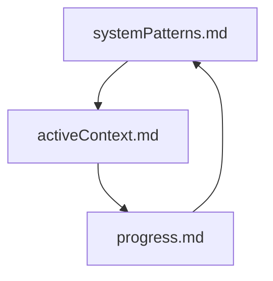
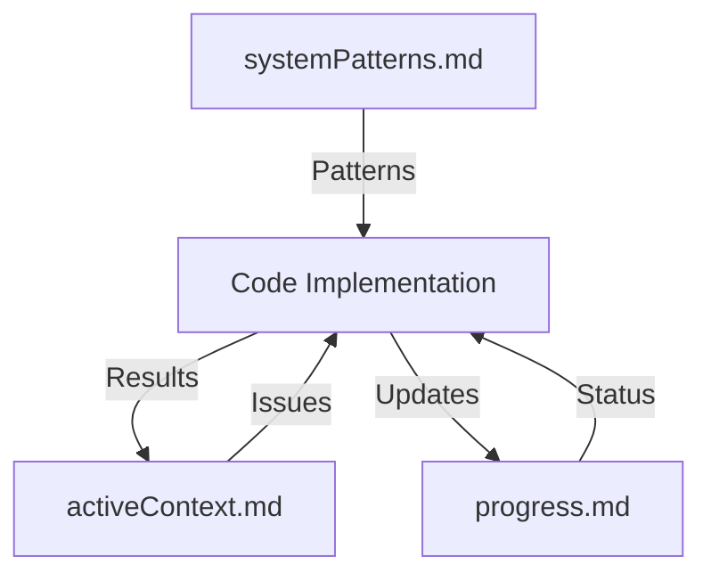
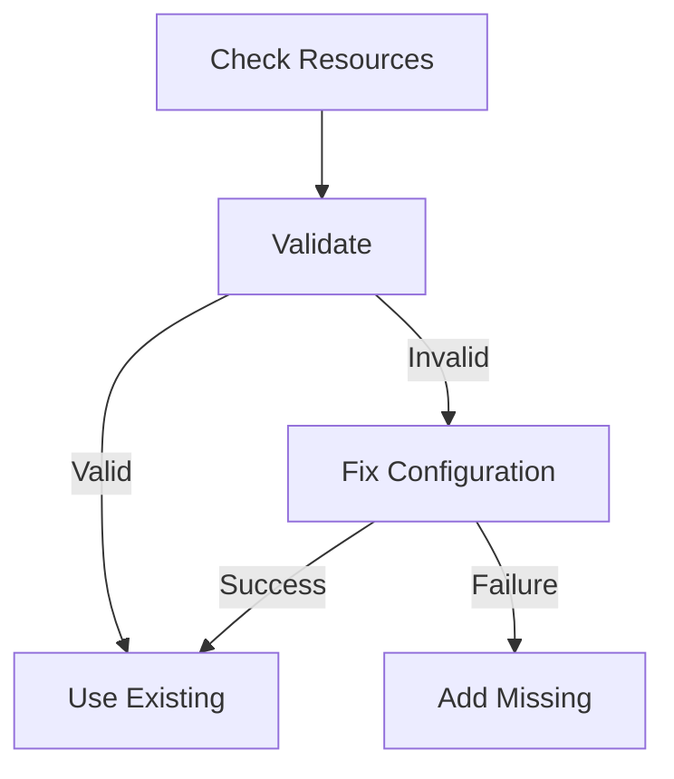

# Memory Registry

## Core Documentation

### Active Files
1. `activeContext.md`
   - Last Updated: 2025-02-19
   - Focus: VPC and NAT Gateway Management
   - Key Topics:
     - Resource preservation
     - NAT Gateway handling
     - Route table management
     - Neptune connection

2. `progress.md`
   - Last Updated: 2025-02-19
   - Status: Current
   - Tracks:
     - VPC infrastructure fixes
     - NAT Gateway updates
     - Neptune improvements
     - Known issues

3. `systemPatterns.md`
   - Last Updated: 2025-02-19
   - Content: AWS Infrastructure Patterns
   - Key Sections:
     - VPC management
     - NAT Gateway handling
     - Resource preservation
     - Connection patterns

### Dependencies

## Recent Updates

### 2025-02-19
1. `systemPatterns.md`
   - Added VPC Resource Management Pattern
   - Added NAT Gateway Management Pattern
   - Updated Lessons Learned
   - Added Resource Dependencies section

2. `activeContext.md`
   - Added VPC Management Strategy
   - Added NAT Gateway Handling
   - Updated Recent Changes
   - Updated Active Decisions

3. `progress.md`
   - Added VPC Infrastructure section
   - Updated Known Issues
   - Added VPC Management to Future Work
   - Updated Current Issues

## Task-Relevant Files

### AWS Infrastructure Management
1. Primary:
   - `systemPatterns.md`: VPC and NAT patterns
   - `activeContext.md`: Current strategy
   - `progress.md`: Implementation status

2. Supporting:
   - `utils/aws/neptune/vpc.py`
   - `utils/aws/neptune/cluster.py`
   - `utils/aws/neptune/__init__.py`

### Implementation Status
1. VPC Management:
   - Status: Fixed
   - Location: vpc.py
   - Pattern: systemPatterns.md#VPC

2. Neptune:
   - Status: Updated
   - Location: cluster.py
   - Pattern: systemPatterns.md#Connection

## Documentation Structure

### AWS Integration

### Resource Management

## Memory Organization

### AWS Services
1. Resource Management
   - VPC patterns
   - NAT Gateway handling
   - Route table updates
   - Resource preservation

2. Connection Management
   - Infrastructure validation
   - Configuration fixes
   - DNS handling
   - Auth configuration

3. Error Handling
   - Common errors
   - Recovery strategies
   - Testing patterns

## Update Frequency

### Regular Updates
1. `activeContext.md`: As issues arise
2. `progress.md`: After each change
3. `systemPatterns.md`: When patterns emerge

### Trigger Events
1. Infrastructure changes
2. Pattern discoveries
3. Implementation updates
4. Error resolutions

## Next Review
- Focus: VPC validation improvements
- Files to update:
  - activeContext.md
  - progress.md
  - systemPatterns.md
- When: After next infrastructure change
