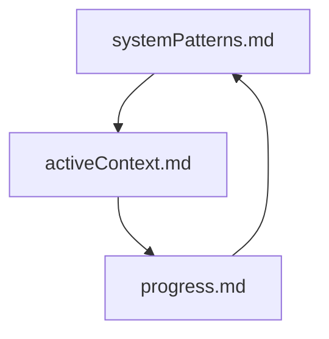
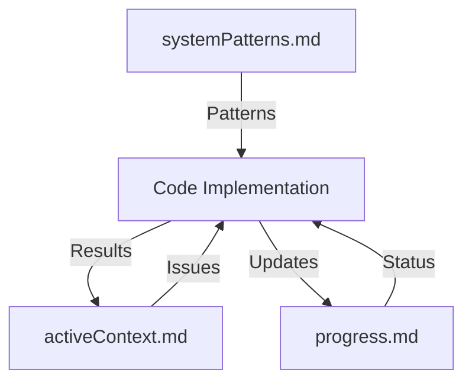
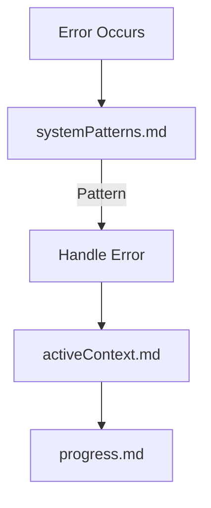

# Memory Registry

## Core Documentation

### Active Files
1. `activeContext.md`
   - Last Updated: 2025-02-16
   - Focus: AWS Service Connectivity
   - Key Topics:
     - OpenSearch connection fixes
     - Neptune connection issues
     - Resource management
     - Next steps

2. `progress.md`
   - Last Updated: 2025-02-16
   - Status: Current
   - Tracks:
     - Completed OpenSearch fixes
     - Ongoing Neptune issues
     - Known issues
     - Future work

3. `systemPatterns.md`
   - Last Updated: 2025-02-16
   - Content: AWS Service Patterns
   - Key Sections:
     - Domain management
     - Authentication
     - Connection handling
     - Error recovery

### Dependencies

## Recent Updates

### 2025-02-16
1. `activeContext.md`
   - Added AWS service connectivity focus
   - Documented OpenSearch fixes
   - Added Neptune connection issues
   - Updated next steps

2. `progress.md`
   - Added completed OpenSearch tasks
   - Updated Neptune connection status
   - Added known issues
   - Updated future work

3. `systemPatterns.md`
   - Added AWS service patterns
   - Added connection strategies
   - Added error handling
   - Added lessons learned

## Task-Relevant Files

### AWS Service Integration
1. Primary:
   - `systemPatterns.md`: Connection patterns
   - `activeContext.md`: Current issues
   - `progress.md`: Status tracking

2. Supporting:
   - `utils/aws/neptune_utils.py`
   - `utils/aws/opensearch_utils.py`
   - `rag_implementations/graph_rag/components/vector_store.py`

### Implementation Status
1. OpenSearch:
   - Status: Fixed
   - Location: vector_store.py
   - Pattern: systemPatterns.md#Connection

2. Neptune:
   - Status: Investigating
   - Location: neptune_utils.py
   - Issues: activeContext.md#Issues

## Documentation Structure

### AWS Integration

### Error Handling

## Memory Organization

### AWS Services
1. Connection Management
   - Patterns in systemPatterns.md
   - Current issues in activeContext.md
   - Progress in progress.md

2. Resource Management
   - Cleanup patterns
   - DNS handling
   - Auth configuration

3. Error Handling
   - Common errors
   - Recovery strategies
   - Testing patterns

## Update Frequency

### Regular Updates
1. `activeContext.md`: As issues arise
2. `progress.md`: After each change
3. `systemPatterns.md`: When patterns emerge

### Trigger Events
1. New AWS service issues
2. Pattern discoveries
3. Implementation changes
4. Error resolutions

## Next Review
- Focus: Neptune connection issues
- Files to update:
  - activeContext.md
  - progress.md
  - systemPatterns.md
- When: After connection fix
