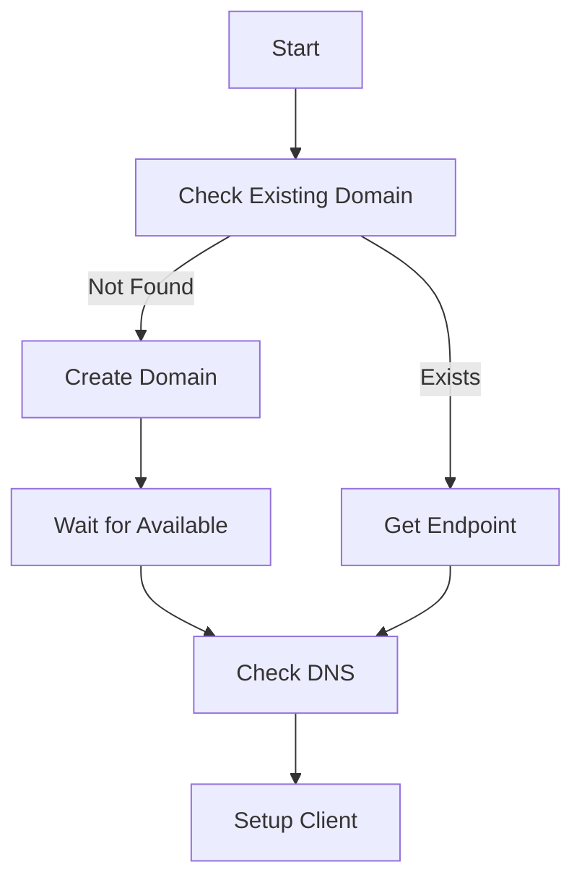
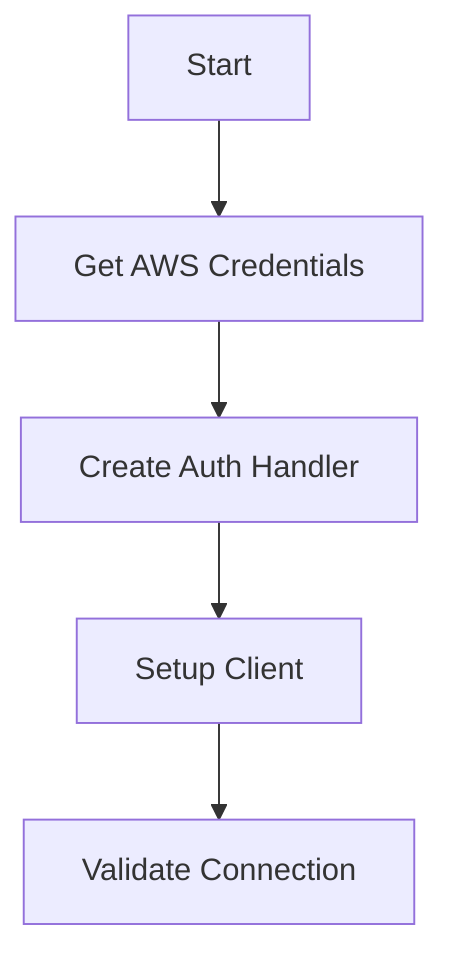
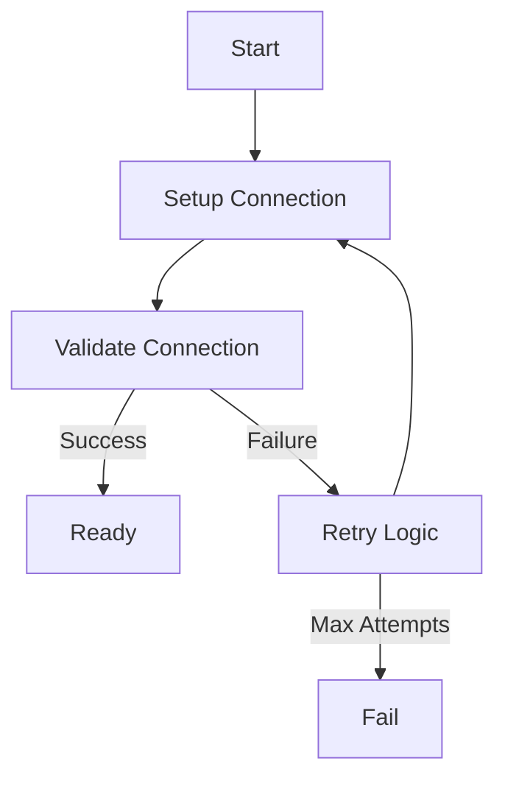
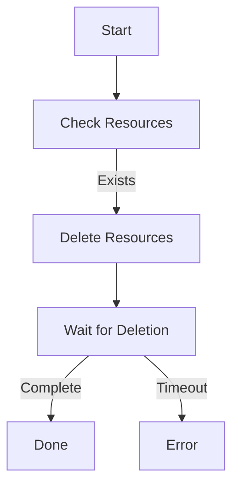

# System Patterns

## AWS Service Connectivity

### 1. Domain Management Pattern


Key Points:
- Always check for existing resources first
- Wait for resources to be fully available
- Validate DNS propagation
- Use consistent naming

### 2. Authentication Pattern


Requirements:
- Use AWS4Auth for OpenSearch
- Include session token if present
- Validate connection after setup
- Handle auth failures gracefully

### 3. Connection Management Pattern


Best Practices:
- Implement exponential backoff
- Set appropriate timeouts
- Handle connection drops
- Clean up resources properly

### 4. Resource Cleanup Pattern


Guidelines:
- Clean up in reverse creation order
- Wait for deletion to complete
- Handle deletion failures
- Prevent cleanup cascades

## AWS Service Quirks

### 1. OpenSearch
- Domain names must be unique per region
- DNS propagation takes time
- Need proper IAM permissions
- Connection requires specific auth

### 2. Neptune
- Requires WebSocket connection
- DNS propagation is critical
- IAM auth timing sensitive
- Event loop management important

## Connection Strategies

### 1. Simple Connection
```python
# Prefer simple synchronous connections
client = OpenSearch(
    hosts=[{'host': endpoint, 'port': 443}],
    http_auth=awsauth,
    use_ssl=True,
    verify_certs=True,
    connection_class=RequestsHttpConnection
)
```

### 2. Retry Logic
```python
def connect_with_retry(max_attempts=5, delay=1):
    for attempt in range(max_attempts):
        try:
            # Attempt connection
            return setup_connection()
        except Exception as e:
            if attempt == max_attempts - 1:
                raise
            time.sleep(min(60, delay * (2 ** attempt)))
```

### 3. Resource Management
```python
def cleanup_resources(delete_all=False):
    try:
        # Delete in reverse order
        cleanup_dependent_resources()
        if delete_all:
            cleanup_primary_resources()
    except Exception:
        # Log but don't fail
        pass
```

## Error Handling

### 1. Common Errors
- DNS resolution failures
- Connection timeouts
- Authentication failures
- Resource not found

### 2. Error Categories
1. Temporary
   - DNS propagation
   - Network issues
   - Service throttling

2. Configuration
   - Auth setup
   - IAM permissions
   - Endpoint format

3. Resource
   - Not found
   - Already exists
   - Wrong state

### 3. Recovery Strategies
1. Retryable Errors
   - Connection timeouts
   - DNS resolution
   - Rate limits

2. Fatal Errors
   - Auth failures
   - Permission denied
   - Invalid configuration

## Testing Patterns

### 1. Connection Testing
```python
def validate_connection(client):
    try:
        # Simple validation query
        client.info()
        return True
    except Exception:
        return False
```

### 2. Resource Validation
```python
def check_resource_state(resource_id):
    try:
        status = get_resource_status(resource_id)
        return status == 'available'
    except ResourceNotFound:
        return False
```

### 3. Cleanup Validation
```python
def verify_cleanup():
    resources = list_resources()
    return len(resources) == 0
```

## Lessons Learned

### 1. AWS Services
- Always check resource existence
- Wait for DNS propagation
- Use consistent naming
- Handle cleanup carefully

### 2. Connection Management
- Prefer simple connections
- Implement proper retries
- Validate connections
- Clean up properly

### 3. Error Handling
- Categorize errors properly
- Implement appropriate retries
- Log detailed errors
- Clean up on failures
