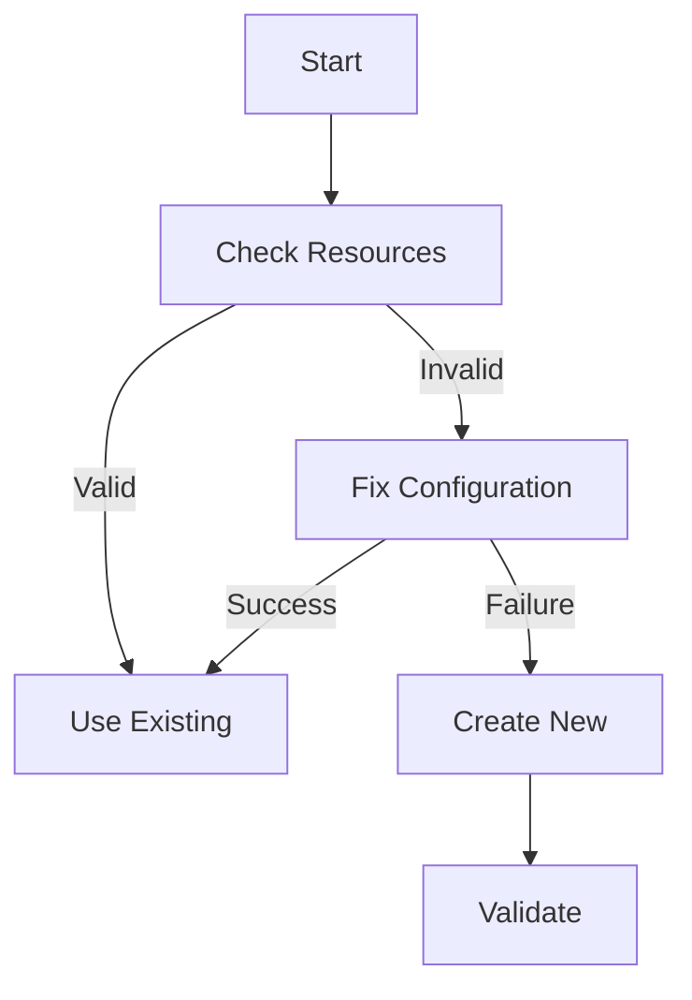
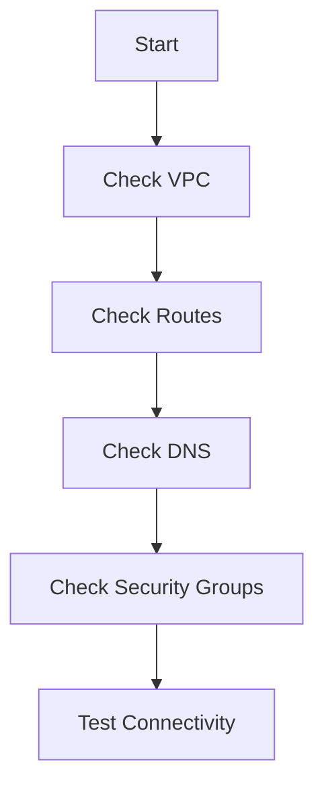
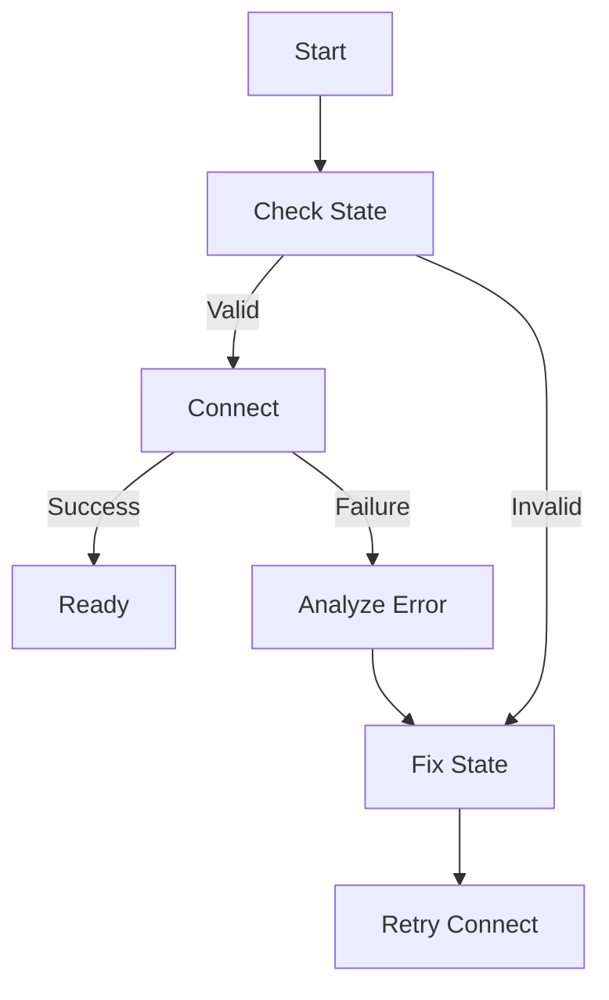
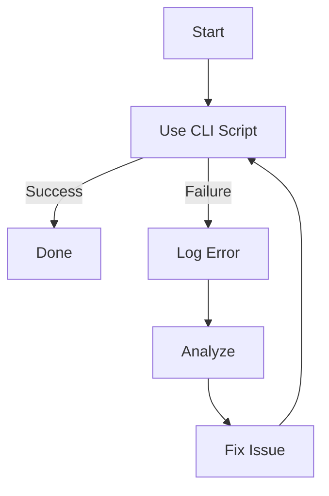

# System Patterns

## AWS Service Connectivity

### 1. Infrastructure Management Pattern


Key Points:
- Always check existing resources first
- Try to fix configurations before recreating
- Only cleanup as last resort
- Require explicit cleanup confirmation

### 2. Resource Validation Pattern


Requirements:
- Validate VPC configuration
- Check routing tables
- Verify DNS resolution
- Test end-to-end connectivity

### 3. Connection Management Pattern


Best Practices:
- Validate before connecting
- Fix configurations when possible
- Implement proper retries
- Handle failures gracefully

### 4. Testing Pattern


Guidelines:
- Prefer CLI script over notebook
- Maintain state properly
- Log errors clearly
- Handle recovery gracefully

## AWS Service Quirks

### 1. SageMaker Integration
- Notebook instance stability
- Git repo persistence
- Kernel connection handling
- State tracking needs

### 2. Neptune
- Configuration validation critical
- DNS propagation important
- Security group rules matter
- Route table configuration key

## Testing Strategies

### 1. CLI Testing
```python
def test_infrastructure():
    """Test infrastructure with validation."""
    # Check existing resources
    if resources_exist():
        if validate_config():
            return use_existing()
        if fix_config():
            return use_existing()
    return create_new()
```

### 2. Validation Logic
```python
def validate_resources():
    """Validate resource configuration."""
    # Check each component
    if not check_vpc():
        return fix_vpc()
    if not check_routes():
        return fix_routes()
    if not check_security():
        return fix_security()
    return True
```

### 3. Connection Testing
```python
def test_connection():
    """Test connection with recovery."""
    try:
        # Validate first
        if not validate_resources():
            raise ValueError("Invalid configuration")
        # Then connect
        return connect_with_retry()
    except Exception as e:
        log_error(e)
        return handle_failure()
```

## Error Handling

### 1. Common Issues
- Notebook stability
- Git persistence
- Connection failures
- State tracking

### 2. Error Categories
1. Infrastructure
   - VPC configuration
   - Route tables
   - Security groups
   - DNS resolution

2. Connection
   - State tracking
   - Recovery handling
   - Timeout management
   - Auth validation

3. Testing
   - Notebook stability
   - State persistence
   - Error logging
   - Recovery procedures

### 3. Recovery Strategies
1. Infrastructure Issues
   - Validate configuration
   - Fix if possible
   - Create new if needed
   - Log changes

2. Connection Issues
   - Check state
   - Fix configuration
   - Retry connection
   - Log failures

3. Testing Issues
   - Use CLI script
   - Track state
   - Log errors
   - Handle recovery

## Lessons Learned

### 1. Infrastructure
- Validate before modifying
- Fix configurations first
- Only cleanup as last resort
- Track state carefully

### 2. Testing
- CLI script over notebook
- Better state persistence
- Clear error logging
- Proper recovery

### 3. Documentation
- Document validation steps
- Note common issues
- Include recovery procedures
- Track stability concerns
